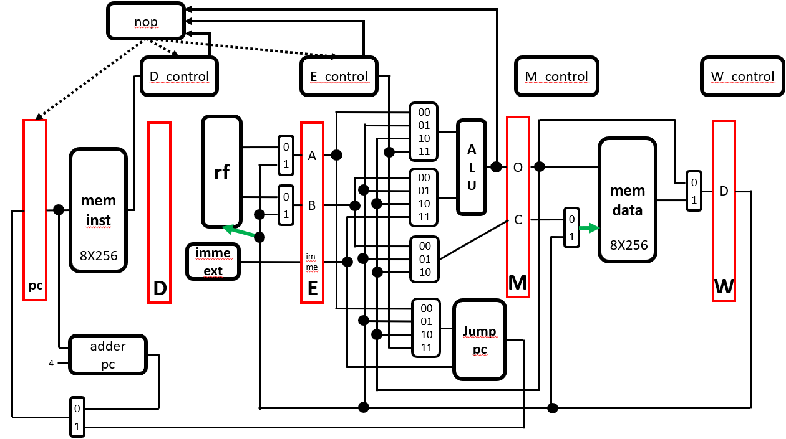
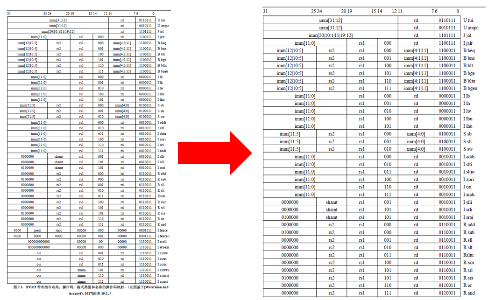

# Final
## 題目 : RISC-V CPU
## 成員
林柏維 E24064216、吳文歆 E24066064、陳哲彥 E24066365  
## 說明  
### 架構設計圖  
  
### 實作的指令  
  
我們這次實作了基本指令中的37條 (47條基本指令 - 狀態相關的10條)  
### Block Design  (bitstream可產生，但是無法測試)  
[simulate](https://github.com/HainanG/2019_FPGA_Design_Group9/tree/master/Final/block_design)  
[synthesis](https://github.com/HainanG/2019_FPGA_Design_Group9/tree/master/Final/block_design)  
* bitstream可以產生 但是不知為啥bsp裡的driver有少 沒辦法測試...  
### testbench 解說  
(以下以10進位表達, vivado波型圖為16進位)  
testbench_v1 :  
1 : addi x2 x0 5  
2 : addi x3 x2 6  
3 : ORI x4 x3 14  
4 : SLLI x6 x4 2  
5 : LUI x7 01000000000000000000  
6 : addi x8 x7 15  
7 : addi x9 x9 1  
8 : BEQ x9 x2 12  
9 : SUB x8 x8 x7  
10 : jal x1 -12  
11 : addi x11 x0 12  
12 : addi x12 x0 100  
13 : SW x12 x11 16  
14 : LW x13 x0 28  
--------------------------------
x1 = 40  
x2 = 5  
x3 = 11  
x4 = 60  
x7 = 01000000000000000000000000000000 (2進位)  
x8 = 01000000000000000000000000001111 (2進位)  
x9 = 5  
x11 = 12  
x12 = 100  
x13 = 100  
mem_data[28] = 100  
  ------------------------------------------------------------------  
testbench_v2 :  
1 : addi x2 x0 3  
2 : S x2 x0 0  
3 : L X3 X0 0  
4 : L X4 X3 -3  
5 : L X5 X4 -3  
6 : L X6 X5 -3  
--------------------------------  
x2 = 3  
x3 = 3  
x4 = 3  
x5 = 3  
x6 = 3  
mem_data[0] = 3  
  ------------------------------------------------------------------  
testbench_v3 :  
1 : addi x2 x0 5  
2 : SLTI x3 x2 6  
3 : andi x4 x3 3  
4 : AUIPC x5  5  
5 : Xori x6 x5 7  
6 : SRLI x7 x6 2  
7 : SRAI x8 x7 2  
8 : SLT x8 x7 x8  
9 : SH x7 x2 3  
10 : SB x7 x2 4  
11 : LH x9 x2 3  
12 : LB x10 x2 x4  
--------------------------------  
x2 = 5  
x3 = 1  
x4 = 1  
x5 = 00000000000000000101000000000000 (2進位)  
x6 = 00000000000000000101000000000111 (2進位)  
x7 = 00000000000000010100000000011100 (2進位)  
x8 = 0  
x9 = 00001402 (16進位)  
x10 = 00000002 (16進位)  
mem_data[8] = 14 (16進位)  
mem_data[9] = 02 (16進位)  
