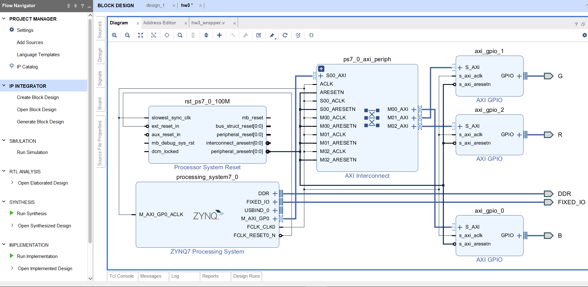

# Homework 3
## 成員
林柏維 E24064216、吳文歆 E24066064、陳哲彥 E24066365
## Question 1.
  
輸出3個陣列的位置，結果如圖所示，位置存放為大→小，可知 ZYNQ CPU 儲存資料的方式為little-endian
## Program 1 - 使用 AXI GPIO - 控制 RGB LED 
建立以 Zynq Processor 和 3個 AXI GPIO 組成的系統   
三個AXI GPIO分別用來連結LED的 R、G、B   
再利用混和色光，即可完成彩虹七色的輪流變換  
### 程式碼說明
宣告Delay的長度   
 

連結程式與板子的LED R G B   
    
燈號控制ex:紅光.橙光 

用for迴圈來製造Delay，讓上個燈號維持一段時間，再換下個燈號  

### 程式主要概念圖
while迴圈重複執行:

### Block diagram

## Program 2 - Hash Function
建立以 Zynq Processor 和 1個 AXI GPIO 組成的系統  
AXI GPIO 用來連結 switches  
當 switch 為 0 時，輸出 E24066064 經 hash function 轉換後的結果  
當 switch 為 1 時，輸出 E24064216 經 hash function 轉換後的結果  
當 switch 為 2 時，輸出 E24066365 經 hash function 轉換後的結果  
當 switch 為 0 時，則輸出 RECIPIENT UNKNOWN  
### BKDR Hash
  
因為輸入的data type 為 char , 所以計算時會轉由 ASCII code 的值計算  
將 hash * seed 後再加上自己的值，放回hash裡  
str指向下一個位置(先 *str 後 str++ )  
一直計算到下一個位置為 0 時會跳出迴圈，最後 return 與 0x7FFFFFFF 做 & 邏輯運算的結果  
即 input[0] 的 hash 會從 input[0] 加到 input[8] ， input[1] 的 hash 為 input[1] 加到 input[8]，以此類推  
### 程式碼說明
  
  
counter用來計算while跑的次數，每 10000000 進去 if 一次以防 while 跑太快 cout 的速度太快  
  
  
以 16進位 輸出結果，為了不要讓數字太常不好看，取了16的餘數，使結果只會有一位 0~F 的數字
### 輸出結果

## Program 3 - Sorting
建立 Zynq Processor 系統  
因為只需輸入與輸出，所以不需要AXI GPIO  
輸入要排列的 20 個數字後存入陣列  
使用 C++ 內建的 sort 排序並輸出結果
### std::sort
  
intclude <algorithm> 來使用 sort  
    
  
排列 陣列n 裡面的數字
### 輸出結果

