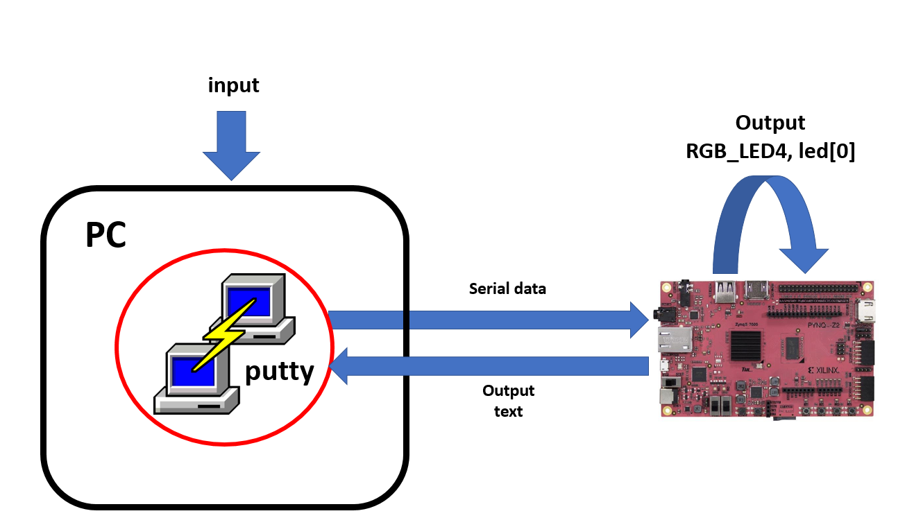
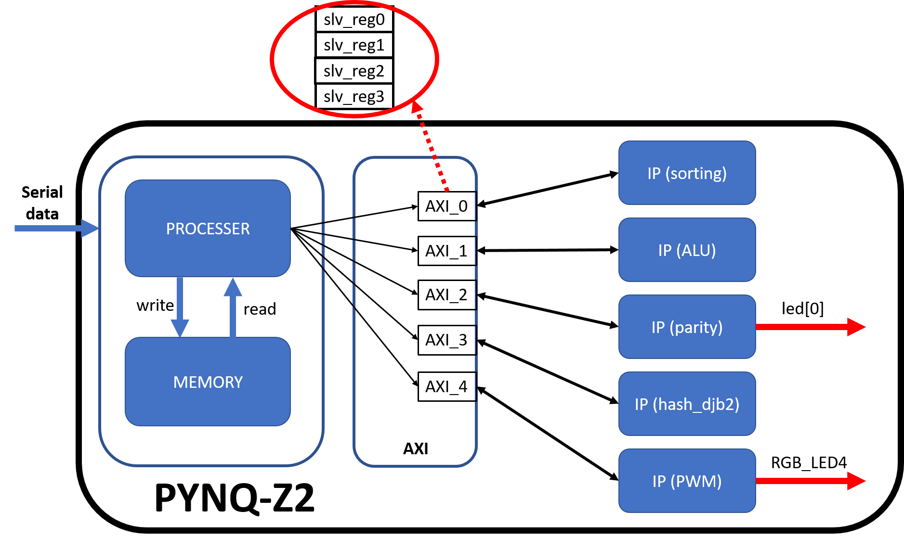
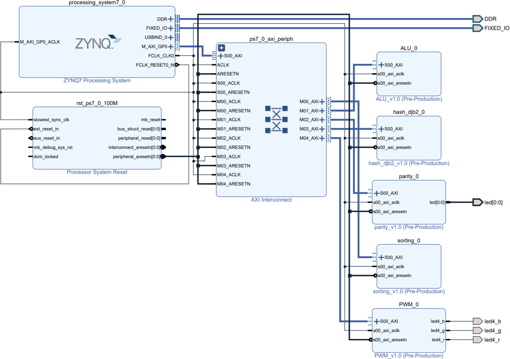

# Homework 4
## 成員
林柏維 E24064216、吳文歆 E24066064、陳哲彥 E24066365
## 整體  
### 整體架構圖
  
### FPGA架構圖
  
### Total Block Diagram  
  
### 其他連結  
[使用說明](使用說明.md)  
[Sorting](program_individual/sorting/Sorting.md)  
[ALU](program_individual/ALU/ALU.md)  
[Parity](program_individual/parity/Parity.md)  
[Hash_djb2](program_individual/hash_djb2/Hash_djb2.md)  
[PWM](program_individual/PWM/PWM.md)

