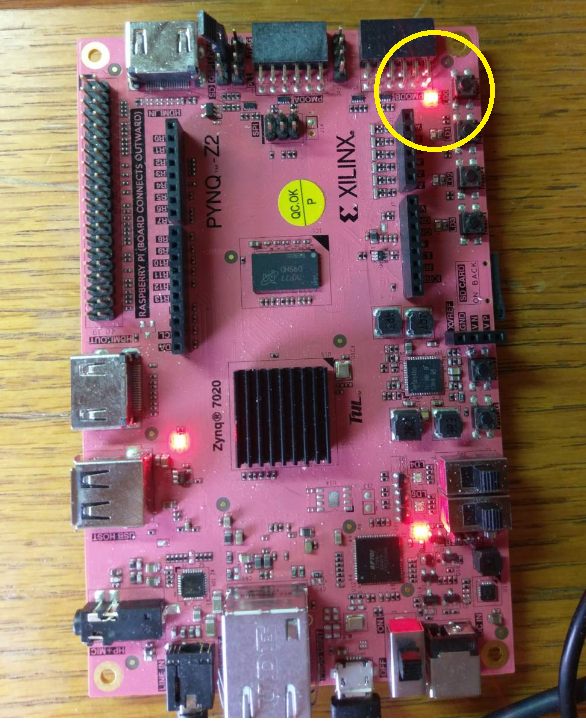

# 使用手冊

## 開始介面

## 輸入1可進入 Sorting模式

依序鍵入8個數字

排序結果

## 輸入2可進入 加減乘運算模式

加法範例

減法範例

乘法範例

正overflow發生:

負overflow發生

## 輸入3可進入 Parity模式

鍵入32bit

輸出結果  odd_parity_bit=1 代表32bit共有偶數個1

當odd_parity_bit為1時，黃圈處燈亮

## 輸入4可進入 Hash模式

hash範例

## 輸入5可進入 PWM模式

分別輸入 R G B 的值(0-255)

RGB範例

RGB_LED 結果

##在任何時刻，輸入zz即可退出

