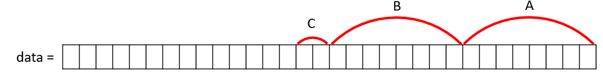
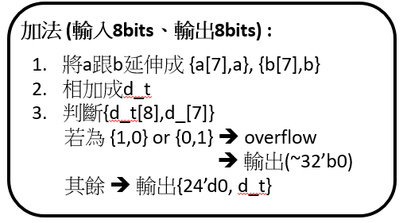
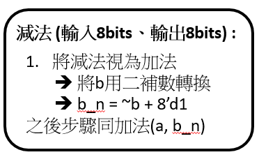

# ALU  
## 說明  
### Step 1:  
依序輸入8bits signed integer A(-128~127), operator(+,-,*), 8bits signed integer B (-128~127)  
### Step 2:
使用 2's complement 做計算，達成 interger 可以任意為正數或負數，並判斷overflow    
### Step 3:  
回傳顯示  
## 構造  
### 輸入資料  
在軟體端，interger 限定只能輸入 -128 ~ 127，operator限定只能輸入 (+,-,*), 其餘不接受    
將輸入 integer A 存入 s32 A、integer B 存入 s32 B、operator 以 integer 存入 s32 C (+ : 0, - : 1 , * : 2)    
將3筆資料用 " << " 存成一個 32bits 的資料  
但是因為integer為有號數，所以做bits相加時，要確保不會被其他資料干擾，  
因此每個資料都取自己的有效部分即可，其餘變 0  
data = (A&0x000000ff) + ((B&0x000000ff) << 8) + ((C&0x00000003) << 16);    
  
將 A 傳入 slv_reg0  
### ALU.v     
接著在 ALU.v 做 +,-,*  
先做 bits extends -> 可用來判斷是否 overflow      
  
  
  
將 答案 傳回 slv_reg1    
### 回傳資料  
在軟體端，讀取slv_reg1  
將接收到的 32 bits 判斷有無 overflow    
1. 有 : 顯示overflow  
2. 無 : 判斷是否為負數  
      (1) 是 : 前面補滿 1 ，顯示
      (2) 否 : 顯示

 
  

