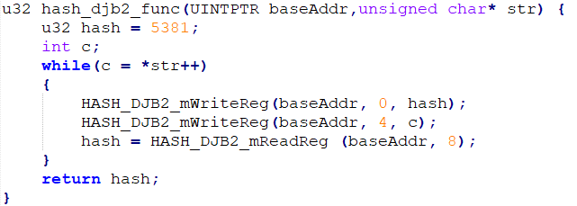

# Hash_djb2  
## 說明  
### Step 1:  
依序輸入3個character(任意character皆可，包含'enter'鍵)  
### Step 2:
做hash_djb2回傳出一個hash值  
### Step 3:  
回傳顯示  
## 構造  
### 輸入資料  
在軟體端，依序輸入3個charater(任意皆可，包含'enter'鍵)，存入一個 unsigned char str[4] 裡  
str[3] = '\0'  
初始 hash = 5381  
用while迴圈   
1.將 hash 存入slv_reg0  
2.將 *str 裡的 character 以 ASCII 轉換成 int 值存入slv_reg1，str++  
3.Hash_djb2.v 算完 存入 slv_reg2  
4.將回傳值當做下一次的 hash 繼續跑while迴圈直至 '\0'  
    
將 最終hash 傳回  顯示  
### hash_djb2.v     
在 hash_djb2.v 做 hash_out = hash_in * 33 + c   
(hash << 5) + hash + c  
將 答案 傳回 slv_reg2  

  

