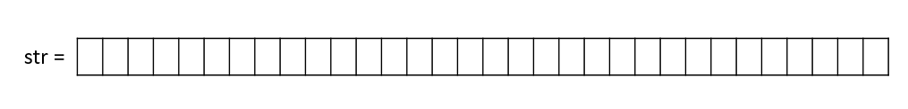

# Parity  
## 說明  
### Step 1:  
依序輸入32 bits (0/1)  
### Step 2:
使用 ~ (^(32bits)) 算出 odd parity bits  
### Step 3:  
回傳顯示，putty端 & led[0]顯示  
## 構造  
### 輸入資料  
在軟體端，依序輸入 32bits (從 str[31] ~ str[0] )限定只能輸入 0 or 1，其餘不接受  
將輸入 32 bits 存成一個 u32 str   
每輸入 1 bit 就存進 u32 str 對應的位置   
  
將 str 傳入 slv_reg0  
### parity.v     
在 parity.v 用 ~(^data) 算出 odd parity bit  
  
1. 將 odd parity bit 傳回 slv_reg1  
2. 將 odd parity bit 接線接出來到 led[0]  
### 回傳資料  
在軟體端，讀取slv_reg1  
將接收到的 odd parity bit 顯示  
   
在硬體端，根據接收到的 odd parity bit 訊號，決定led[0] 要不要亮  
>程式一開始執行(案run)時 led[0] 初始值會亮
>之後執行 parity program 再退出 (‘zz’) led[0] 會改成 0
