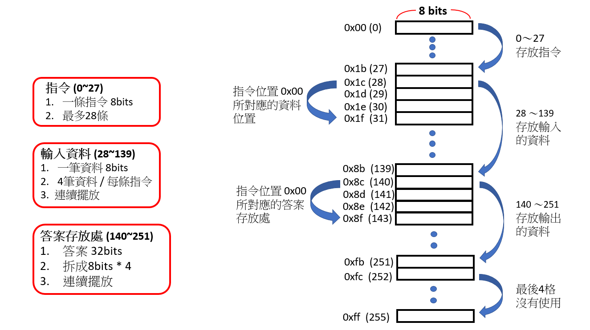
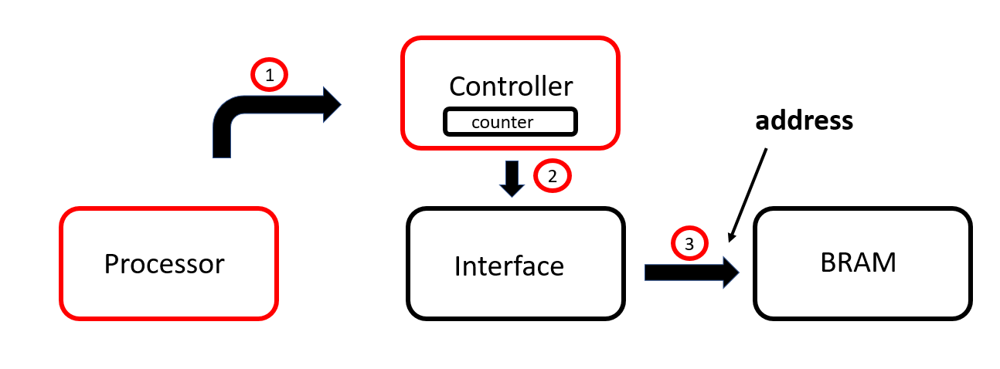
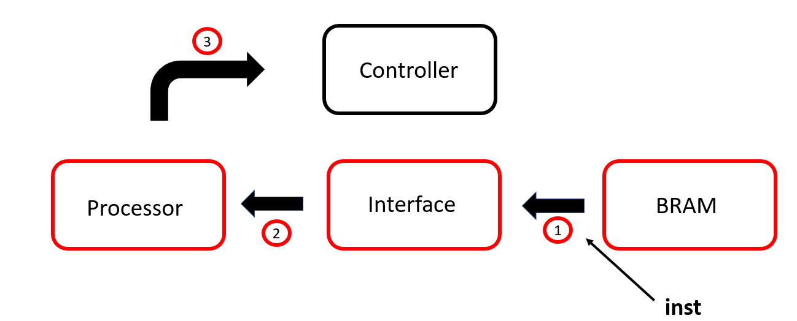
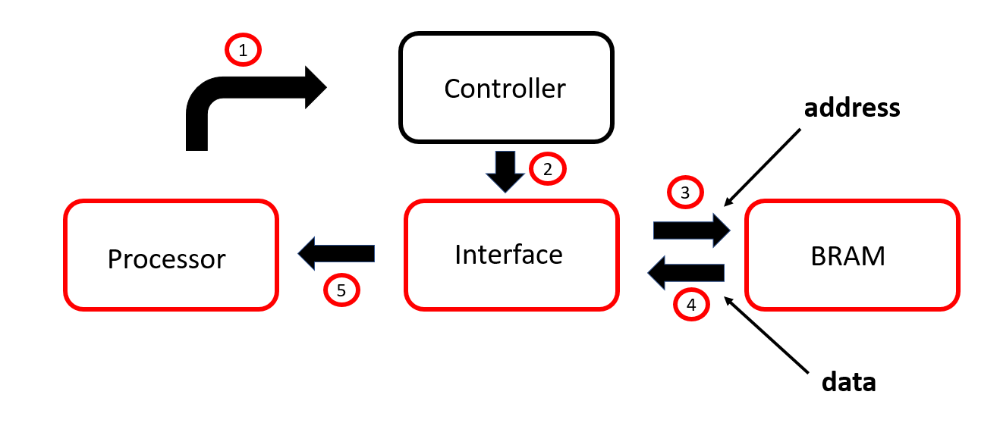
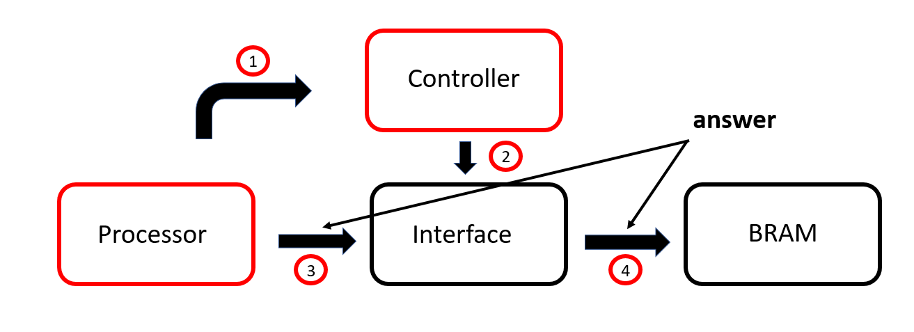
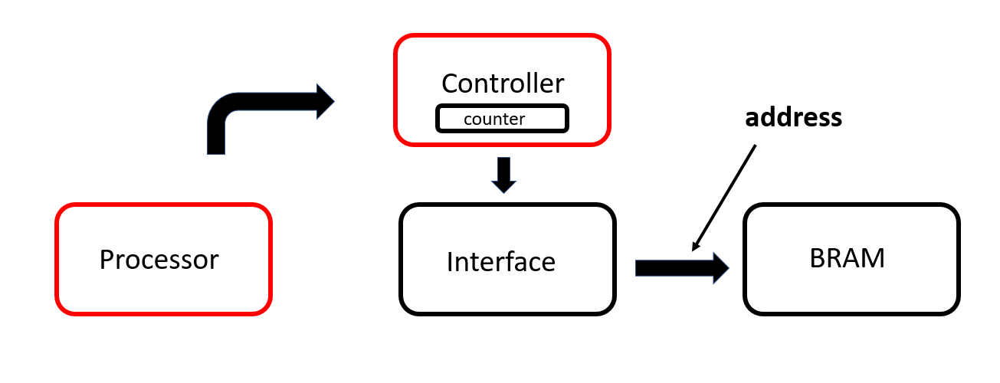

# Homework 5
## 成員
林柏維 E24064216、吳文歆 E24066064、陳哲彥 E24066365
## 說明  
### 記憶體分配(256 * 8-bits)  
  
### Step 1
  
一開始 Processor 告訴 Controller 要讀取下個指令  
Counter+1 ，透過 Interface 從 BRAM 中存取對應位置 ( address = Counter ) 的指令 
### Step 2
  
讀到指令 ( 加、減、乘、轉置、行列式 ) 後，Processor 判斷並告訴 Controller 是否合法 ( 不為 8 個 0 )  
若不合法，則重複圖中 1、2、3 步驟  
### Step 3
  
若合法，Controller 透過 Interface 向 BRAM 拿取對應位置的資料 ( address * 4 + 28 開始連續 4 個位置 ) 並傳至 Processor  
### Step 4
  
Processor 運算完後告訴 Controller，並透過 Interface 將答案存回 BRAM 的對應位置 ( address * 4 + 28 * 5 開始連續 4 個位置 )  
### Step 5
  
儲存完後，Processor 告訴 Controller 要讀取下個指令  
Counter+1 ，透過 Interface 從 BRAM 中存取對應位置 ( address = Counter ) 的指令  
接著重複Step 1 ~ Step 4
