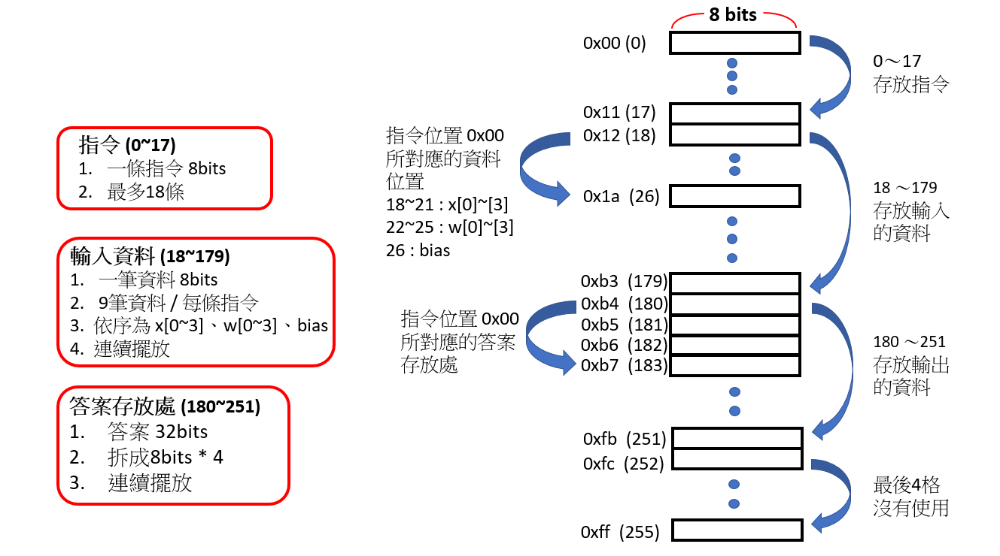
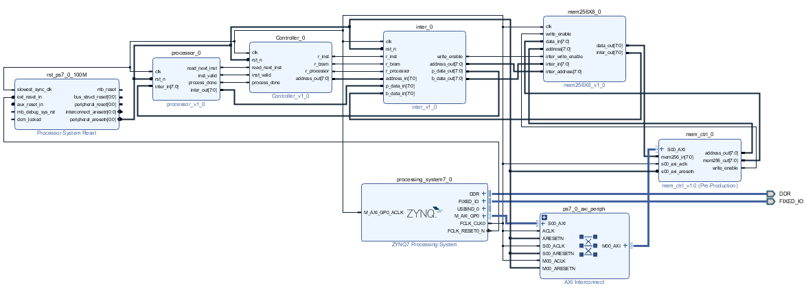

# Homework 6
## 成員
林柏維 E24064216、吳文歆 E24066064、陳哲彥 E24066365
## 說明  
### 記憶體分配(256 * 8-bits)  
  
運作原理同 [Lab05](https://github.com/HainanG/2019_FPGA_Design_Group9/blob/master/Lab05/README.md)  
### [更新] Block Design  
  
助教對不起..考試太忙了QQ  
## 指令  
6 : 卷積運算 (1~5為hw5的指令，此程式不適用)  
  
輸入資料依序為 x[0]、x[1]、x[2]、x[3]、w[0]、w[1]、w[2]、w[3]、bias  
每一筆輸入資料皆為 8-bits (值可以是-128~127)  
支援負數運算 (2補數)  
不支援小數點運算  
輸出資料為 32bits，拆成 4 個 8-bits 存至 mem256X8 中
## 備註  
測試檔在src裡  
指令一次最多18條 (盡量用17條就好，不然會無限迴圈XD)  
