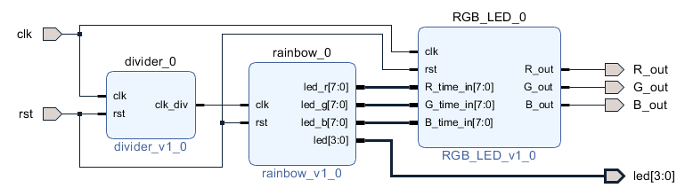

# Homework 2
## 成員
林柏維 E24064216、吳文歆 E24066064、陳哲彥 E24066365
## Program 1 - 使用 PWM 產生彩虹七色
### block design

### 說明
*devider* 產生週期為0.5秒的 clock (clk_div)  
*rainbow* 吃 clk_div 實現每2秒換燈號顏色  
將要輸出的顏色以 RGB 各 8bits 表達傳給 *RGB_LER*  
*RGB_LED* 吃 100MHz 的 clock (clk)  
以256個 clock 為 1turn  
設一 counter reg (8bits) 來計 clock 數  
若 counter < 該顏色輸出1，否則輸出0  
以此方法來達成視覺上所看到的顏色。  
※另外，在右下角用led顯示狀態
（紅色：1， 橘色：2， 黃色：3， 綠色：4， 藍色：5， 靛色：6， 紫色：7）

## Program 2 - 使用單色 LED 實作呼吸燈
controller : 控制led的亮度 以8bits(255)來表達亮度   
PWM : 設一 counter reg (8bits)每個 clock+1 ， 若 counter < 亮度輸出1，否則輸出0 ， 以此方法達成視覺上可見的亮度控制   
 
controller吃週期為10ns的clk  
設3個counter => counter_10ns、counter_1us、counter_1ms 來計時間  
若 counter_10ns == 99 => counter_1us + 1  
若 counter_10ns == 99 && counter_1us == 999 => counter_1ms + 1  
若 counter_10ns == 99 && counter_1us == 999 && counter_1ms == 999 => mode = ~mode  
 
mode表示此時為漸亮(0)或漸暗(1)  
以此方法達成 漸亮1秒 漸暗1秒  
 
設一 time_in reg (8bits)表達亮度  
因為漸亮漸暗皆為1秒 => 將 0 ~ 255 均分成1000等分  
因為不能整除 => 250均分成1000等分 => counter_1ms 為4的倍數時 => time_in + 1 (漸暗則 - 1)  
( 每當 counter_10ns == 99 && counter_1us == 999 && counter_1ms[1:0] == 2'b11 => time_in + 1 )  
 
將 time_in 傳給 PWM
在 PWM 裡設一 counter reg (8bits) 來計 clock 數  
若 counter < time_in 輸出1，否則輸出0  
以此方法來達成視覺上所看到的亮度。  

## Bonus - 電競 RGB 呼吸燈
此題融合上面2個program即可實現  
將第一題即將輸出的顏色再串接 PWM 決定輸出 1 or 0  
PWM 一樣由controller控制  
可以將第一題想成要輸出的顏色  
第二題 PWM 像是一個遮蔽物  
若是被遮住了就輸出0 沒被遮住就輸出原本要輸出的顏色。

## 備註
這禮拜期中考，沒時間好好寫README QQ，沒什麼圖片很抱歉 Orz  
Bonus 將2個結合後沒有達成 漸亮漸暗 => 換下一個燈  
做出了漸亮或漸暗到一半 就換顏色，沒什麼時間弄好同步QQ  
不過換顏色後還是繼續沒做完的漸亮或漸暗 所以看起來不會卡卡的 反而炫了一點(?  
我猜應該是要把clk都正規化就可以解決了，第二題的controller因為是用counter來算，所以算出來的秒應該是有點延遲  
不然就是其實一開始的clk並非100MHz，因為我把clk週期以10ns來算，我發現弄出來1秒會變1.5秒的樣子呢  
之後再好好弄清楚，先準備考試 ><  
